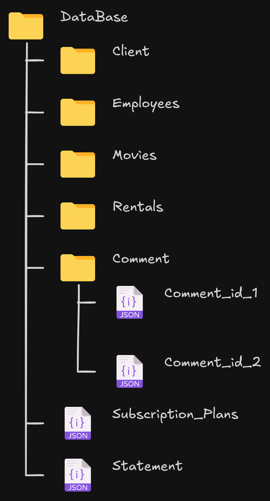

# RANDOM PLAY

RANDOM PLAY, é uma programa que permite locaduras gerirem os seus negócios e ao mesmo tempo permite que o utilizadores possam ver o catálogo, este programa será em python e na consola.

## Gestão

### Início

Quando iniciado o programa pela primeira vez, requisitará vários dados sobre a locadura, como por exemplo:

> Nome da locadura;

> Email proprietário da locadura;

> Localização da locadura;

> Número de telefone;

> Nomes dos proprietários;

Depois de inserir os dados da locadura, será necessário criar o admin (o proprietário), como por exemplo:

> Nome;

> Idade;

> Número de telefone;

> NIF;

Com os dados do programa será criado em ficheiro JSON a seguinte forma:

```javascript
"employees": [
    {
      "id": 1,
      "name": {
        "first name": "Wise",
        "last name": "Spirit"
      },
      "age": 26,
      "NIF": 685658468,
      "phone": 933688799,
      "role": "owner",
      "is active": true,
      "email": "wise.spirit@random.play",
      "password": "..."
    }
]
```

```javascript
"statement": {
    "name": "Random Play",
    "creation date": "20-04-2007",
    "owner's email": "@random.play",
    "location": {
      "street": "Rua João",
      "city": "Vila Coves",
      "region": "Porto",
      "country": "Portugal"
    }
  }
```

### Criação de funcinários

Depois a criação do admin, o admin pode escolher em criar como:

> Admin;

> Funcinário;

> Cliente;

> Filmes;

> Planos de Assinatura;

Ex:

```javascript
"movies": [
	{
		"id": 1,
		"name": "Last Survivor",
		"year of release": 2023,
		"producer's name": "António Silva",
		"studio": "Garras Pretas",
		"genre": "Humor",
		"director": "Miguel Nunes",
		"amount": 15,
	}
]
```

```javascript
"employees": [
    {
      "id": 2,
      "name": {
        "first name": "Francisco",
        "last name": "Esteves"
      },
      "age": 18,
      "NIF": "685657458",
      "phone": 933688788,
      "role": "customer support",
      "is_active": true,
      "email": "francisco.esteves@random.play",
      "password": "..."
    }
```

```javascript
"clients": [
    {
      "id": 1,
      "name": {
        "first name": "Ana",
        "last name": "Silva"
      },
      "age": 16,
      "phone": 933688599,
      "is_active": true,
      "email": "ana.silva@gmail.com",
      "subscription plan": "premium",
      "password": "..."
    },
	{
      "id": 2,
      "name": {
        "first name": "Gustavo",
        "last name": "Carreira"
      },
      "age": 23,
      "phone": 933688684,
      "is_active": true,
      "email": "gustavo.carreira@gmail.com",
      "subscription plan": "basic",
      "password": "..."
    }
]
```

```javascript
"subscription_plans": [
	{
		"id": 1,
		"name": "basic",
		"description": "...",
		"price": 0
	},
	{
		"id": 2,
		"name": "premium",
		"description": "...",
		"price": 9.99
	}
]
```

## Utilizadores 

Com a locadura criada, os utilizadores podem criar as suas contas, para isso terá um menu principal, com o Login e create account.

No login pedirá o email e a password, claramente vai verificar os dois casos. Já na criação da conta será requisitado o seguinte dados:

> Nome;

> Idade;

> Email:

> Password;

> Número de telefone;

Com os dados obetidos o programa irá criar as seguintes dados:

> Id;

> Plano (default basic);

Com os dados criados o utilizador voltará à página de antes e fará o login, o programa vai distinguir entre as contas de funcinários e clientes e mostra a página inicial. Na página inicial poderá ver os principais filmes requisitados, poderá ver a descrição, nome, nome do diretor, nome dos estudio e ver a disponibilidade do mesmo. Poderá fazer um filtro e escolherá o que quer filtrar, como nome, datas, nome de diretor e enrte outros.

Também terá uma amba para alterar os dados da conta ou pedir uma eleminação da conta (será um soft delete).

Dentro dos filmes pode avaliar-lo até 5 estrelas e dar um comentário e depois cada utilizador pode avaliar o comentário e ver quem escreveu.

Nos comentários será uma ficgeiro para cada filme, assim permite melhor performace no ficheiro, para isso o programa iria criar uma pasta dentro do comment -> id do filme -> ficheiro.

Ex:

```javascript
"comment": [
	{
		"id": 1,
		"client_id": 2,
		"comment": "...",
		"rating": 4,
		"creation_date": "20-01-2024",
		"edited": false,
		"likes": []
	}
]
```

O cliente, pode fazer alugar um filme dentro do programa, que fará um ficheiro json sobre o aluguel.

Ex:

```javascript
"rentals": [
  {
    "id": 1,
    "client_id": 1,
    "movie_id": 3,
    "rented_on_program": "04-05-2025"
    "rented_on": "05-05-2025",
    "due_date": "12-05-2025",
    "returned": false
  }
]
```

Sobre o "rented\_on\_program" é a data quando se faz a marcação do aluguel dentro site, já o "rented\_on" é a data que o utilizador vai buscar o filme

## Programa



#### Divisão dos ficheiros


Para a primeira vez que o programa for inicializado fará uma verificação do statement, caso estiver vazio ou não exister ele começará na parte da criação da locadura.
