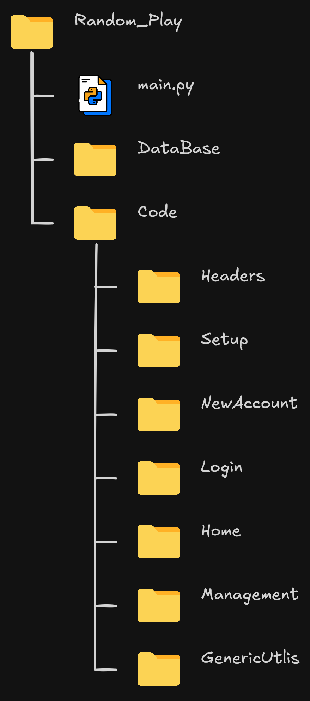
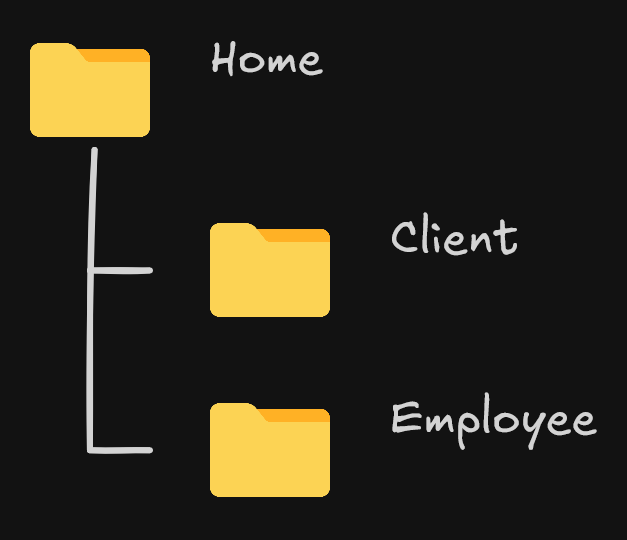
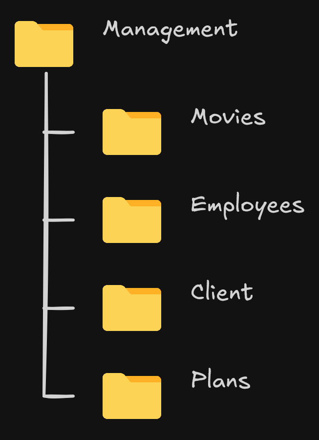

# RANDOM PLAY - DESIGN DE CÓDIGO

O código estará dividido em várias pastas, com as suas funções, nas seguinte forma:

O main.py, é o começo da execução do código (página inicial do login ou new account). O code é o diretório aonde está o código.

## Headres

Uma sub pastas que ficam os headers de apresentação ao utilizador.

## New Account

Uma sub pasta que ficam as criações da conta como do cliente e dos funciobnário.

## 

## Login

Uma sub pasta que ficam a lógica do login.

## Home

Uma sub pasta que fica a apresentação do home, que depende ao tipo de utilizador.

## Management

Uma sub pasta que fica a gestão da locadura, só para os funcinários.

## GenericUtlis

Uma sub pasta com funções que serão usadas ao longo do programa, como cls (limpa o terminal), e as ferramentas de benchmark.

Cada pasta terá a usa propria utlis, para casos necessários
